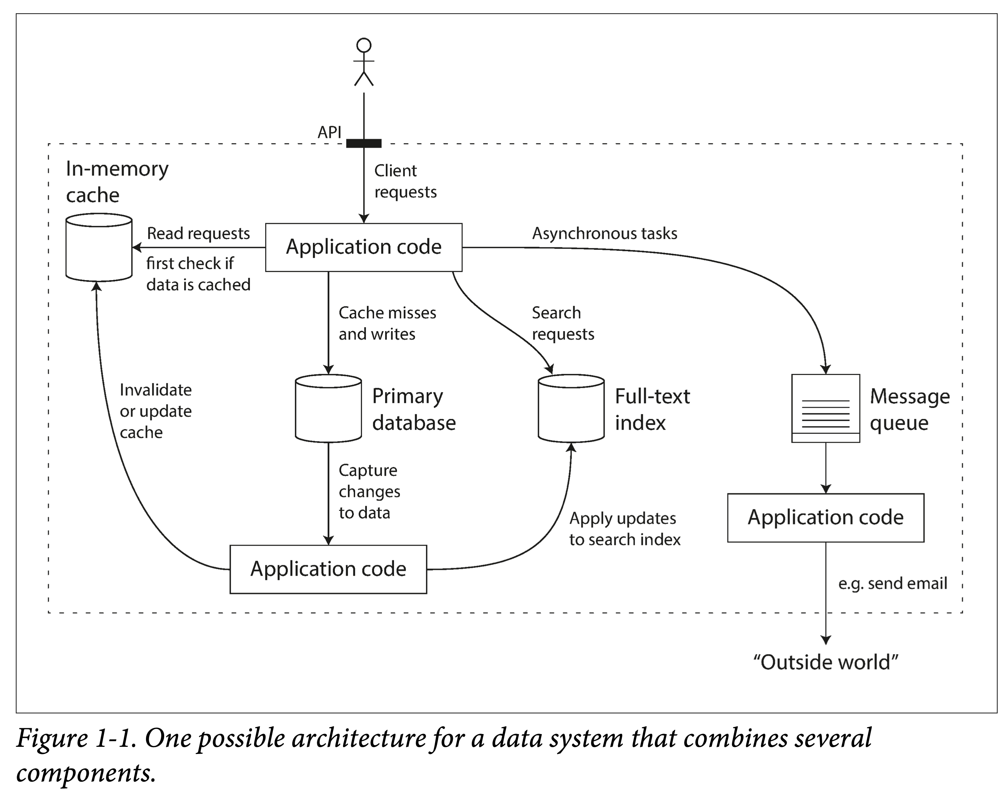

---  
layout: post
title: Designing Data-Intensive Applications 03
categories: book,DDIA
description: 第一章，Foundations of Data Systems，数据系统的基础
keywords: 读书笔记,DDIA,Designing Data-Intensive Applications
---  

# the fundamental ideas that apply to all data systems  

A data-intensive application is typically built from standard building blocks that pro‐
vide commonly needed functionality. For example, many applications need to:   
• Store data so that they, or another application, can find it again later (databases)  
• Remember the result of an expensive operation, to speed up reads (caches)  
• Allow users to search data by keyword or filter it in various ways (search indexes)  
• Send a message to another process, to be handled asynchronously (stream pro‐
cessing)  
• Periodically crunch a large amount of accumulated data (batch processing)  

数据密集型的应用，共有的功能

但就这么一个小系统，在设计时，就可以有很多取舍：  
使用何种缓存策略？是旁路还是写穿透？  
.....

There are various approaches to caching, several ways of building search indexes, and so on. When building an application, we still need to figure out which tools and which approaches are the most appropriate for the task at hand.

> 设计数据密集型应用时，选择具体的框架和工具，往往是一个折中讨论，拉会汇报，权衡不同的方面的一个抉择的过程

> 我碰到过的是：workflow 设计的时候，选择工作引擎，IM 系统选择消息的协议，数据库选择，以及消息的推送等等

In this chapter, we will start by exploring the fundamentals of what we are trying to achieve: reliable, scalable/ˈskeɪləbl/, and maintainable 
/meɪnˈteɪnəbl/ data systems.
这个章节的目的：探讨构建可靠、可扩展、可维护的数据系统所需的基本原理。

书中用了三个词来回答：可靠性（Reliability）、可扩展性（Scalability）、可维护性（Maintainability）

可靠性：Reliability
The system should continue to work correctly (performing the correct function at the desired level of performance) even in the face of adversity (hardware or soft‐ ware faults, and even human error).
可扩展性：Scalability
As the system grows (in data volume, traffic volume, or complexity), there should be reasonable ways of dealing with that growth. 
可维护性：Maintainability
Over time, many different people will work on the system (engineering and oper‐ ations, both maintaining current behavior and adapting the system to new use cases), and they should all be able to work on it productively. 

首先是详细的定义：

功能上
正常情况下，应用行为满足 API 给出的行为
在用户误输入/误操作时，能够正常处理
性能上 在给定硬件和数据量下，能够满足承诺的性能指标。
安全上 能够阻止未授权、恶意破坏。